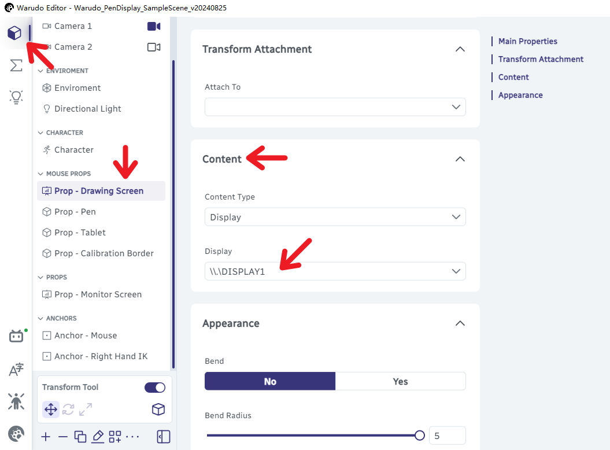

# Pen Display Hand Sync
## Introduction

This page provides an example scene to help you **build your own live for drawing or designing**.  
It will allow you to **hold the pen** and have it **follow your cursor in the screen asset** perfectly in the Warudo world!

<video controls loop src="/doc-img/pen-display-hand-sync-10.mp4" />

Showcase!

## Tutorials

###  Step 1 - Preparation

1. First, you need to subscribe the following items in Steam workshop to continue the following tutorials:

	| Item        | Steam workshop URL                                                                         |
	|:----------- |:------------------------------------------------------------------------------------------ |
	| Environment | [🔗 Loft Apartment](https://steamcommunity.com/sharedfiles/filedetails/?id=3033191267)        |
	| Character   | [🔗 VRoid Avatar Sample A](https://steamcommunity.com/sharedfiles/filedetails/?id=3003820352) |
	| Prop 1      | [🔗 Square Grid](https://steamcommunity.com/sharedfiles/filedetails/?id=3295273541)           |
	| Prop 2      | [🔗 Drawing Tablet Set](https://steamcommunity.com/sharedfiles/filedetails/?id=3146409616)    |
	| Node        | [🔗 Mouse Position Nodes](https://steamcommunity.com/sharedfiles/filedetails/?id=3159188937)  |

2. Next, you need to download the following file and put it into the `<WARUDO_DATA_FOLDER>\Scenes` folder:

<ol style={{ "list-style-type": "none" }}><li>
<ul><li>
    <a
    target="_blank"
    href="/scenes/Warudo_PenDisplay_SampleScene_v20240828.json"
    download="Warudo_PenDisplay_SampleScene_v20240828.json">
      🔗 Warudo_PenDisplay_SampleScene_v20240828.json
    </a> 
</li></ul>
</li></ol>

3. Then, you can open the scene you downloaded by the `Open scene` option in Warudo.

:::warning[For Warudo Pro Users]

You need to switch URP (Nilotoon) to BiRP to follow this tutorial.  
You can switch it back after the configuration is complete, and replace the environment and  character to URP version.

:::

### Step 2 - Assign Display (For Multi-Display Users)

1. Determine the monitor you want the Warudo main window to locate.  
(called **Monitor A**)
2. Determine the monitor you want to display in Warudo.  
(called **Monitor B**)

If Monitor A = Monitor B, you can directly skip to **step 3**, otherwise:

3. ✨ Change the `Output Offset X/Y` values in the `Mouse Position Relative To Screen` node to make sure the `Output` is `(0,0)` when your mouse is locate at the the **upper left corner** of Monitor B.

	

:::tip[How to determine your offset values]

1. Move your mouse to the **upper left corner** of Monitor B. 
2. Input the ❗ **Opposite Value** ❗ of `Output` now into `Output Offset X/Y`.  
**e.g.** If the Output is (1920, -1080) when the mouse is at the upper left corner, you need to fill:  
`Output Offset X` = `-1920`  
`Output Offset Y` = `+1080`
3. Verify the ✨ step again.

:::

:::warning

Every time you change your selection of Monitor A or B, you need to re-adjust the offset values.

:::

### Step 3 - Enter Display Resolution

Input the resolution (in pixel) of **Monitor B** in the `Decompose Vector2` node.

:::note[Common 16:9 resolutions]

| Size  |  X   |  Y   |
|:-----:|:----:|:----:|
| 1080p | 1920 | 1080 |
|  2K   | 2560 | 1440 |
|  4K   | 3840 | 2160 |
|   ⋯   |  ⋯   |  ⋯   |

:::

### Step 4 - Select Display

Select the **Display for Monitor B** as the `Content` - `Display` in `Prop - Drawing Screen`.

### Step 5 - (Optional) Customize Assets

:::info

**We recommend skipping this step for the first try.**

:::

You can use the **Onboarding Assistant** to configure your own character, environment, and motion capture.

You can also customize the positions of the character and screen.

For different characters, you may need to adjust the values of **`Trnasform` - `Position`** in **`Anchor - Right Hand IK`** to make the character hold the pen better.

:::warning

You need to **disable the `Finger Movements` pendulum physics in your motion capture settings!**  

- We also recommend turning off other body-related pendulum physics ( like `Arm Movements` and `Body Lean`).

:::

### Step 6 - Calibrate Mapping

Adjust the **`X`** and **`Y`** values in the `Scale` of `Prop - Calibration Border`, respectively.   
Make sure that the screen fits the **Inner Edge** of the red box as perfectly as possible.

:::note

You need to unlock the 🔗 **`Uniform Scaling`** before adjusting scale each time.

:::

### Step 7 - Hide Calibration Border

Finally, you can hide the **`Prop - Calibration Border`** asset by switch its `Enabled` option to `No`.

:::warning

Do not delete `Prop - Calibration Border`, if so, you will not be able to calibrate next time.

:::

## Things to note

- You may need to change **`Mirrored Tracking`** or **`Invert Hands`** in the motion capture asset to choose the tracking method you prefer.

- If you want to change the selection of Monitor A or Monitor B, you need to repeat Step 2–6.

- You can adjust the thickness of **`Prop - Drawing Screen`** or enable and adjust the scale of **`Prop - Tablet`** to further increase the realism.

## Known Issues

### Hand-Pen Clipping

Since the first priority of this blueprint is to **align the pen tip with the cursor**, limited by the implementation principle of hand IK, when the hand is too far away from the screen center, the pen may not fit your hand perfectly.

So we recommend not to adjust the scale of screen too large.

Binding the pen to the finger bone can avoid this problem, but the pen will not be able to perfectly follow the cursor, which is more suitable for pen tablet rather than pen display.  
(This scene currently does not support this mode)

### Display Disappear

If you click the close button in the upper right corner of the Warudo main window but without exiting, the screen will disappear (Because the option list of display becomes null).

This is a bug waiting to be fixed, and currently can only be solved by exiting warudo and reopening it. (You can still save your changes)

<AuthorBar authors={{
  creators: [
    {name: 'hanekit', github: 'hanekit'},
  ],
  translators: [
  ],
}} />
