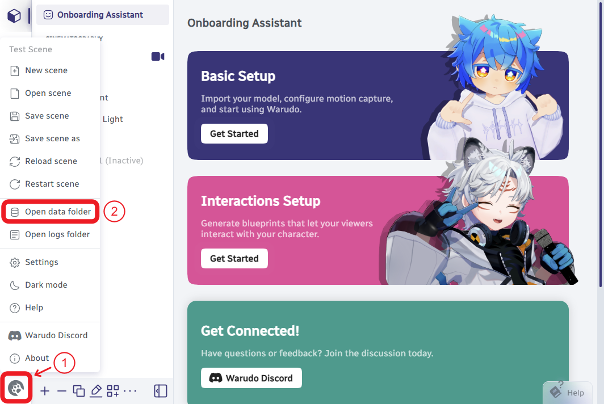

# Data Folder

The data folder of Warudo is a folder names `StreamingAssets`, which is used to store various data files that Warudo can use.

---

## How to find it

You can click **Menu** ➜ **Open data folder** to open it.



It is usually located at path:

```
<STEAM_ROOT_DIR>\steamapps\common\Warudo\Warudo_Data\StreamingAssets
```

## Subfolders

The data folder contains multiple subfolders, used to categorize different types of files.

Details are as follows (in alphabetical order):

### Binaries

This folder contains some binary files related to the program.  
Please do not delete or modify them.

### CharacterAnimationProfiles

This folder is used to store the **character's animation profile** files.

**Supported Format:** JSON (`*.json`)

When you use the “**Save Animation Profile**” button in the “**Animation**” Section of the “[**Character**](/docs/assets/character)” Asset, the character's current animation settings will be saved to this folder.

You can use the profile files in the following scenarios:
- “[**Character**](/docs/assets/character)” Asset – “**Animation**” Section – “**Load Animation Profile**” Button
- “**Load Character Animation Profile**” Node – “**Animation Profile**” Port

You can also open this folder directly using the “**Open Animation Profiles Folder**” button in the “**Animation**” Section of the “[**Character**](/docs/assets/character)” Asset.

### CharacterAnimations

This folder is used to store **character animation** files that the characters can play.

**Supported Formats:**
- Unity Animation Clip (`*.anim`)
- [Warudo Character Animation Mod](/docs/modding/character-animation-mod) (`*.warudo`)

You can use the animation files in the following scenarios:

- “[**Character**](/docs/assets/character)” Asset – “**Animation**” Section – “**Idle Animation**” Option
- “[**Character**](/docs/assets/character)” Asset – “**Animation**” Section – “**Overlaying Animations**” – “**Animation**” Option
- “**Character Animation Source**” Node – “**Value**” Port
- “**Get Random Character Animation**” Node – “**Character Animations**” Port
- “**Play Character One Shot Overlay Animation**” Node – “**Animation**” Port
- “**Play Character Idle Animation**” Node – “**Animation**” Port

You can also open this folder directly using the “**Open Character Animations Folder**” button in the “**Animation**” Section of the “[**Character**](/docs/assets/character)” Asset.

### CharacterExpressionProfiles

This folder is used to store the **character's expression profile** files.

**Supported Format:** JSON (`*.json`)

When you use the “**Save Expression Profile**” button in the “**Expressions**” Section of the “[**Character**](/docs/assets/character)” Asset, the character's current expression settings will be saved to this folder.

You can use the profile files in the following scenarios:
- “[**Character**](/docs/assets/character)” Asset – “**Expressions**” Section – “**Load Expression Profile**” Button

You can also open this folder directly using the “**Open Expression Profiles Folder**” button in the “**Expressions**” Section of the “[**Character**](/docs/assets/character)” Asset.

### Characters

This folder is used to store **character model** files.

**Supported Formats:**
- VRM 0.x Model (`*.vrm`)
- VRM 1.0 Model (`*.vrm`)
- [Warudo Character Mod](/docs/modding/character-mod) (`*.warudo`)

You can use these files in the “**Source**” Option of the “[**Character**](/docs/assets/character)” Asset.

You can also open this folder directly using the “**Open Characters Folder**” button in the “[**Character**](/docs/assets/character)” Asset.

### Clients

This folder contains some files related to the program.  
Please do not delete or modify them.

### Environments

This folder is used to store **enviroment** files.

**Supported Format:** [Warudo Environment Mod](/docs/modding/environment-mod) (`*.warudo`)

You can use these files in the “**Source**” Option of the “[**Environment**](/docs/assets/environment)” Asset.

You can also open this folder directly using the “**Open Enviroments Folder**” button in the “[**Enviroment**](/docs/assets/environment)” Asset.

### HandGestureProfiles

This folder is used to store the **character's hand gesture** files.

**Supported Format:** JSON (`*.json`)

When you use the “**Record New Hand Gesture**” button in the “**Detect Character Hand Gesture**” Node, the character's hand gesture will be saved to this folder.

You can use the profile files in the following scenarios:
- “**Detect Character Hand Gesture**” Node – “**Gesture**” Port

### HandPoses

This folder is used to store **character's hand pose** files.

**Supported Formats:** **(Under development ...)**

You can use the hand pose files in the following scenarios:

- “[**Character**](/docs/assets/character)” Asset – “**Animation**” Section – “**Override Hand Poses**” Option – “**Pose**” Option
- “**Enable Character Override Hand Pose**” Node – “**Pose**” Port

### Images

This folder is used to store the **image** files.

**Supported Format:** Image formats

You can use the image files in the following scenarios:
- “**Spawn Sticker From Local Image**” Node – “**Image Source**” Port – “**Get Random Local Image**” Node – “**Images**” Port
- “[**Screen**](/docs/assets/screen)” Asset – “**Image Source**” Option (“**Content Type**” should be “**Image**”)
- “**Discover**” Panel – “**Published Items**” Tab – “**Create Item**” – “**Preview Image**” Option

### LipSyncProfiles

This folder contains some files related to the program.  
Please do not delete or modify them.

### Localizations

This folder contains some files related to the program.  
Please do not delete or modify them.

### MMD

**Supported Format:** [Vocaloid Motion Data (MikuMikuDance)](https://mikumikudance.fandom.com/wiki/VMD_file_format) (`*.vmd`)

You can use the files in the following scenarios:
- “**MMD Player**” Asset – “**Character Motion**” Option

### Motions

**Supported Format:** Warudo Animation Data (`*.wanim`)

You can create the Warudo Animation Data files by “**Motion Recorder**” Asset.

You can use the files in the following scenarios:
- “**Motion Player**” Asset – “**Motion Sources**” Option

You can also open this folder directly using the “**Open Motions Folder**” button in the “**Motion Recorder**” Asset.

### Music

**Supported Formats:** Audio formats

You can use the files in the following scenarios:
- “**Music Player**” Asset – “**Source**” Option
- “**Play Music**” Node – “**Source**” Port
- “**Music Source**” Node – “**Value**” Port

You can also open this folder directly using the “**Open Music Folder**” button in the “**Music Player**” Asset.

### Particles

**Supported Format:** [Warudo Particle Mod](/docs/modding/particle-mod) (`*.warudo`)

You can use the files in the following scenarios:
- “[**Prop**](/docs/assets/prop)” Asset– “**Source**” Option
- “**Particle Source**” Node – “**Value**” Port
- “**Get Random Particle**” Node – “**Particles**” Port
- “**Spawn Particle**” Node – “**Source**” Port
- “**Throw Prop**” Node – “**Impact Particle Source**” Port

### PendulumPhysicsProfiles

This folder is used to store the **pendulum physics profile** files.

**Supported Format:** JSON (`*.json`)

You can use the files in the following scenarios:
- **Motion Capture** Assets – “**Pendulum Physics**” Section – “**Load Pendulum Physics Profile**” Button
- “**Load Pendulum Physics Profile**” Node – “**Pendulum Physics Profile**” Port

You can also open this folder directly using the “**Open Pendulum Physics Profiles Folder**” button in the “**Pendulum Physics**” Section of the **Motion Capture** Assets.

### Playground

**Supported Format:** C# Source Code File (`*.cs`)

Please check: [Playground](/docs/scripting/playground)

### Plugins

**Supported Format:** [Warudo Plugin Mod](/docs/scripting/creating-your-first-plugin-mod) (`*.warudo`)

### Props

**Supported Format:** [Warudo Prop Mod](/docs/modding/prop-mod) (`*.warudo`)

You can use the files in the following scenarios:
- “[**Prop**](/docs/assets/prop)” Asset– “**Source**” Option
- “**Prop Source**” Node – “**Value**” Port
- “**Get Random Prop**” Node – “**Props**” Port
- “**Throw Prop**” Node – “**Prop Source**” Port

You can also open this folder directly using the “**Open Music Folder**” button in the “**Music Player**” Asset.

### Scenes

This folder is used to store the **Warudo Scene** files.

**Supported Format:** JSON (`*.json`)

You can use the scene files in the following scenarios:
- **Menu** – **Open scene**

### Screenshots

When you use the “**Take Screenshot**” button in the “**Output**” Section of a “[**Camera**](/docs/assets/camera)” Asset, the camera's current output will be saved to this folder in PNG format.

Similarly, when you invoke a “**Take Screenshot**” Node, the selected camera's current output will be saved to this folder in PNG format.

### Sounds

**Supported Formats:** Audio formats

You can use the files in the following scenarios:
- “**Play Sound**” Node – “**Source**” Port
- “**Sound Source**” Node – “**Value**” Port
- “**Get Random Sounds**” Node – “**Sounds**” Port
- “**Throw Prop**” Node – “**Launch/Impact Sound Source**” Ports

You can also open this folder directly using the “**Open Sounds Folder**” button in the “**Play Sound**” Node.

### SteamVR

This folder contains some files related to the program.  
Please do not delete or modify them.

### Videos

This folder is used to store the **video** files.

**Supported Formats:** Video formats

You can use the image files in the following scenarios:
- “[**Screen**](/docs/assets/screen)” Asset – “**Video Source**” Option (“**Content Type**” should be “**Video**”)

## Additional Subfolders

:::tip
Some plugins from Steam Workshop may also create additional subfolders under `StreamingAssets`.
:::

We also recommend you to create the following Subfolders to better manage files related to Warudo:

### AssetProfiles

This folder can be used to store **asset profile** files from “**Export asset to file**” button.

### Blueprints

This folder can be used to store **blueprint** files from “**Export blueprint to file**” button.

<AuthorBar authors={{
  creators: [
    {name: 'Hane', github: 'hanekit'},
  ],
  translators: [
  ],
}} />
